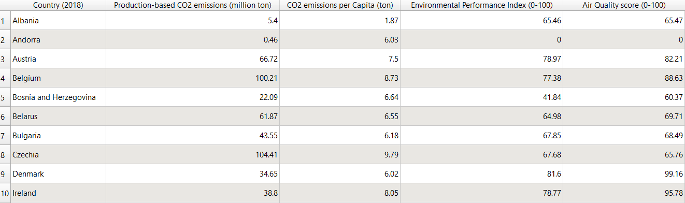
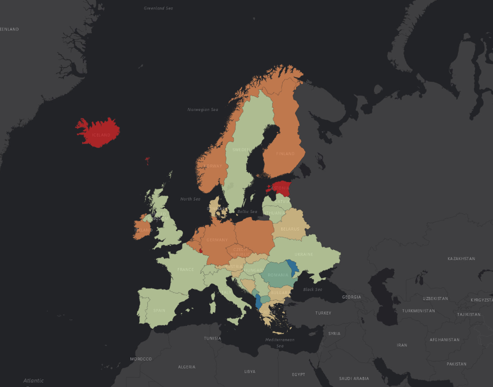

# CO2 Emissions and Air Quality in Europe in 2018

## There are 5 attributes to every feature:
       1- Country
       2- Production-based CO2 emissions (million ton) that European countries emit in 2018.
       3- CO2 emissions per person (ton) in 2018.
       4- Environmental Performance Index (EPI_2018)
       5- Air quality (AIR_2018) indicator.
     
      

       
     
 ## It is a choropleth map based on CO2 emissions per person.
      
 
      
 ### The Attributions:

Yale Center for Environmental Law and Policy - YCELP - Yale University, Yale Data-Driven Environmental Solutions Group - Yale University, Center for International Earth Science Information Network - CIESIN - Columbia University, and World Economic Forum - WEF. 2018. 2018 Environmental Performance Index (EPI). Palisades, New York: NASA Socioeconomic Data and Applications Center (SEDAC). https://doi.org/10.7927/H4X928CF. Accessed DAY MONTH YEAR.
Wendling, Z., D. Esty, J. Emerson, M. Levy, A. de Sherbinin, et al. 2018. The 2018 Environmental Performance Index Report. New Haven, CT: Yale Center for Environmental Law and Policy. https://epi.envirocenter.yale.edu/node/36476.

Hannah Ritchie, Max Roser and Pablo Rosado (2020) - "CO₂ and Greenhouse Gas Emissions". Published online at OurWorldInData.org. Retrieved from: 'https://ourworldindata.org/co2-and-other-greenhouse-gas-emissions' [Online Resource]
 
